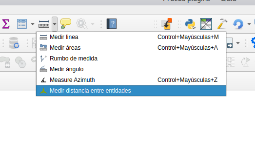
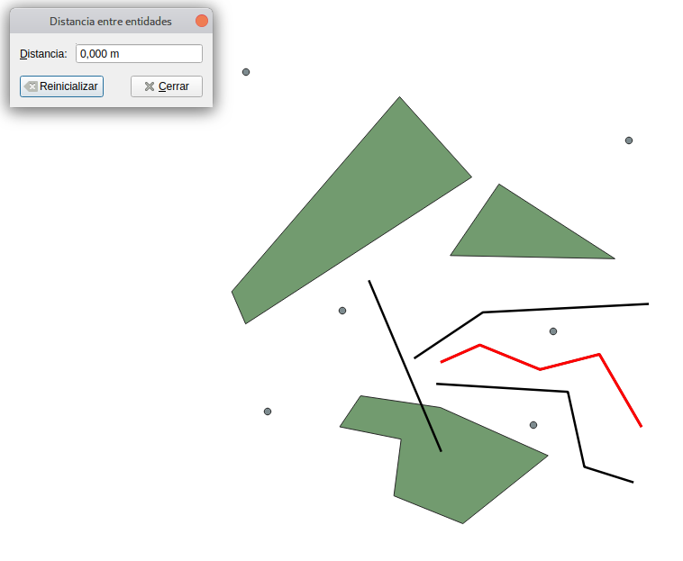
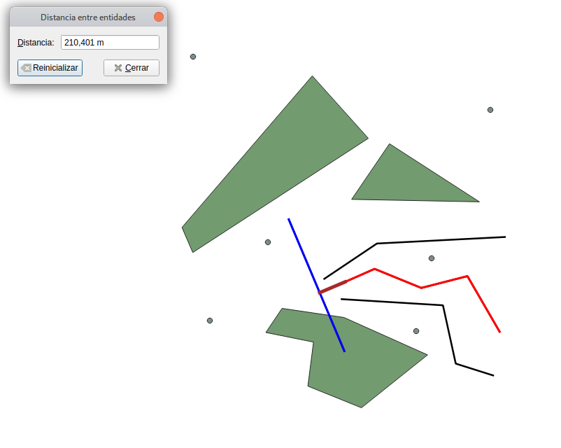
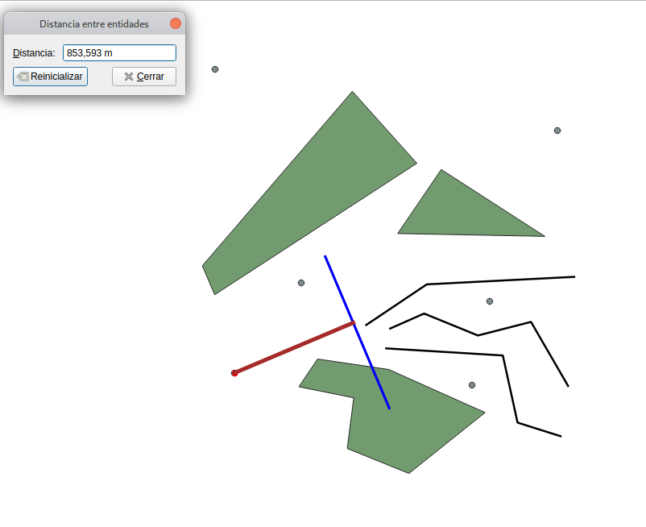
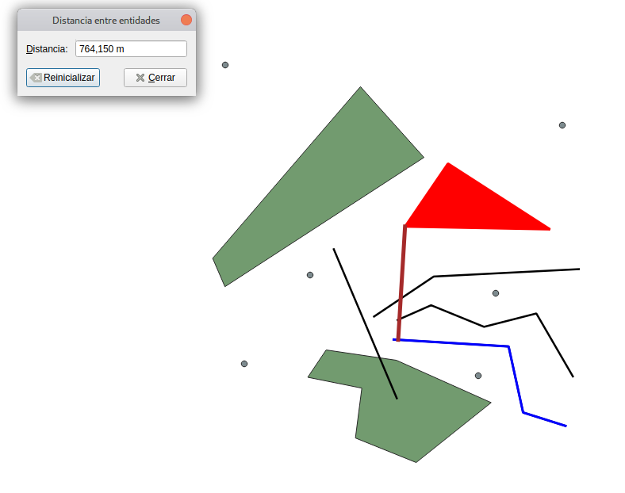

# Medir Distancia Entre
QGIS Plugin para medir la distancia mínima entre dos entidades.

Plugin para medir la distancia mínima entre dos entidades de forma rápida. La mediciópn se efectúa de forma directa sobre la ventana del mapa identificando los elementos, sin la necesidad de crear capas auxiliares o ejecutar geoprocesos. El plugin admite el cálculo de la distancia indistintamente del tipo de entidad (entre polígonos, de polígono a línea, entre líneas, etc.).
## Uso
Una vez instalada, activar/descativar la herramienta pulsando su icono en la paleta de 'Medidas':

Señalar la primera entidad haciendo clic sobre ella. Se resaltará de color rojo:

Señalar la segunda entidad, haciendo igualmente clic sobre ella. Ésta se resalta en color azul, y la herramienta dibuja la línea de mínima distancia entre ambas entidades. Se podrá ver su longitud en el cuadro de diálogo (distancia mínima que separa ambas entidades):

La herramienta funciona con tipos no homogéneos de entidades, calculando también la distancia entre punto y línea...

...entre líneas y polígonos...

...etc.

Una vez obtenida una distancia, si se hace clic sobre otra entidad, la herramienta devolverá la distancia mínima entre la primera y esta última entidad seleccionada.

Para defrinir una entidad inicial diferente, reiníciese la herramienta con el botón correspondiente del cuadro de diálogo.
